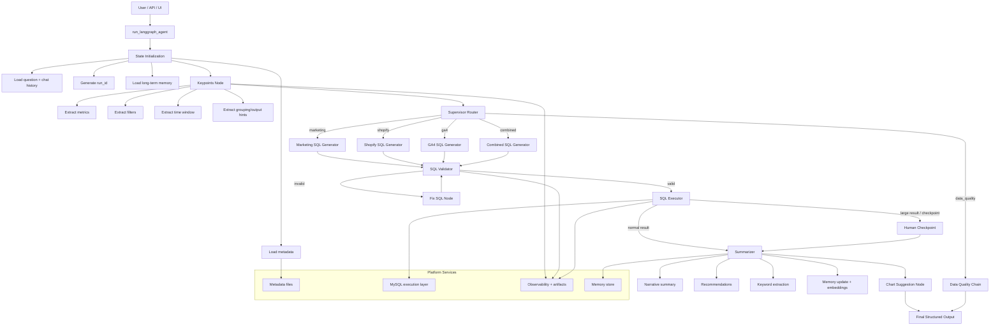
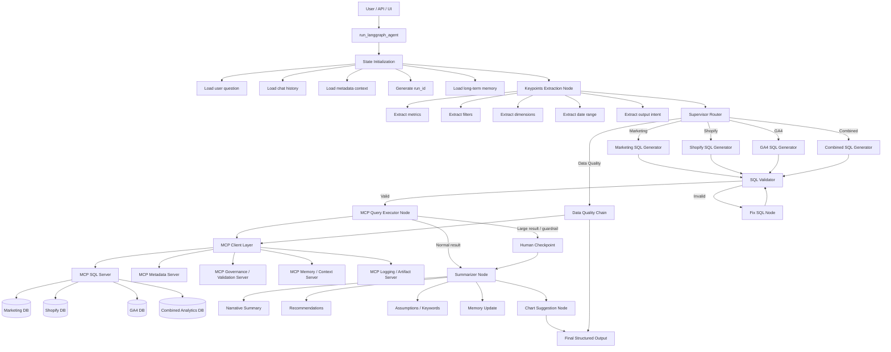
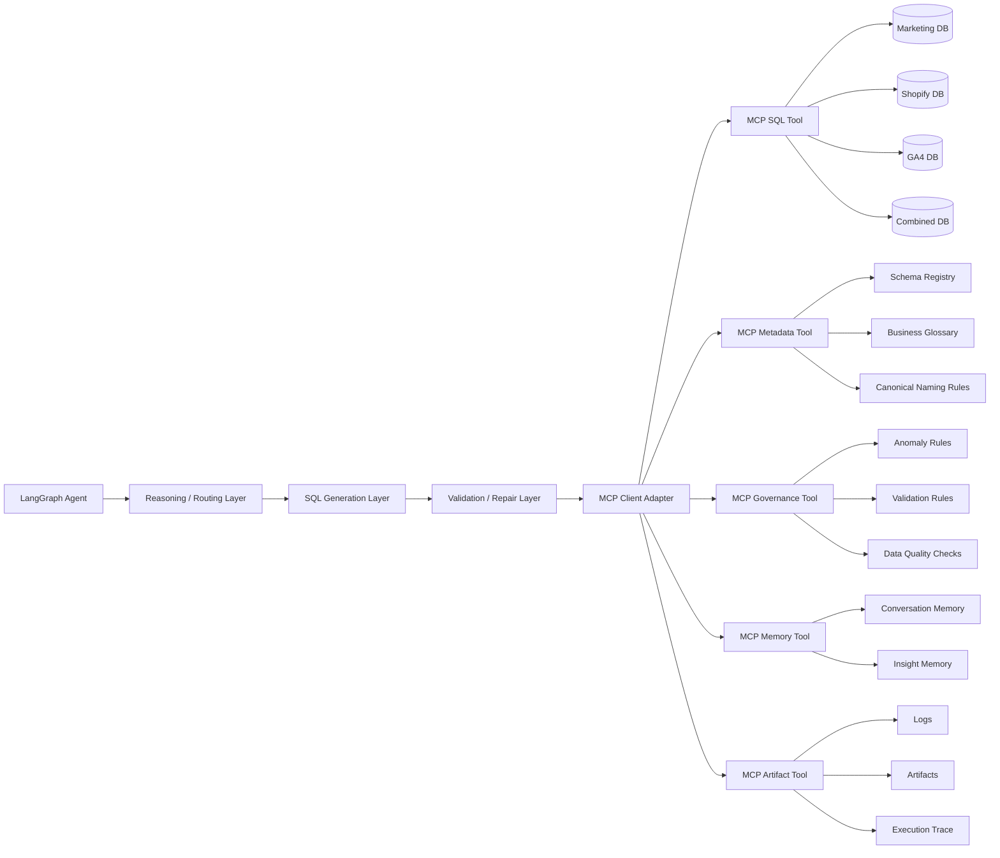

# 🧠 Analytics AI — Natural Language to SQL Agent

### Conversational Analytics Engine for Unified Marketing, Shopify, and GA4 Data

---

## 🚀 Overview
Analytics AI turns plain English questions into data-driven insights.

It uses **LangChain**, **LangGraph**, and **LLM reasoning** to convert natural language questions into **validated SQL queries**, execute them, summarize results, and even suggest the best visualizations.

---

## 🧩 Key Features
- 🧠 **Natural Language to SQL** – Ask “Top 10 products by revenue this year” and get instant SQL & results.  
- ⚙️ **Multi-Domain Router** – Automatically detects whether query relates to **Shopify**, **GA4**, or **Marketing**.  
- ✅ **Auto Validation & Fixes** – Detects broken SQL, fixes joins, normalizes syntax.  
- 📊 **Chart Suggestion Engine** – Suggests best chart types (bar, line, funnel, etc.) based on data.  
- 🗣️ **Narrative Summary** – Generates AI-written summaries and recommendations from query results.  
- 🔄 **Combined Source Analysis** – Merge Shopify (sales) with GA4 (web activity) for holistic insights.  

---

## 🧠 Architecture Overview

# 🧠 Canoniq Architecture Overview (MCP-Based Design)

Canoniq is a **stateful, multi-domain analytics agent** built on **LangGraph**.  
Instead of connecting directly to databases, the system uses an **MCP (Model Context Protocol) tool layer** to access structured data, metadata, validation services, and other external resources.

This design decouples orchestration from data access and creates a more scalable, secure, and extensible architecture for analytics, governance, and future agentic workflows.

---

## 1. High-Level Architecture

## MCP-Oriented Detailed Architecture

